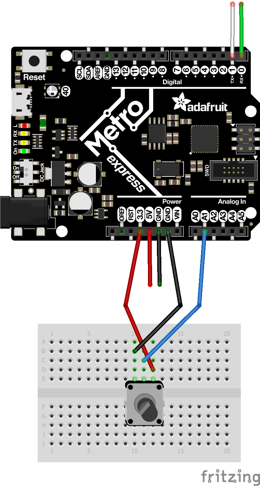

# ExpertCircuitPy
Meg Expert CircuitPython

https://github.com/chssigma/Markdown_Cheatsheet

http://wiki.chssigma.com/index.php?title=User:Mgist56

## Hello Processing
First Expert CircuitPython assignment; drawing a bouncing ball in Processing.
### Resources
https://processing.org/examples/bounce.html
### Images

### Takeaways
Processing.org is a useful resource, especially the Examples and Reference pages. For this assignment, River and I utilized the Bounce page under the Examples page on Processing. We simply modified the code to fit the specific requirements of the assignment. Lines 34 through 39 change the direction of the ellipse when it makes contact with the side of the window. I decided to make the background an obnoxious shade of fuchsia because I could.

## CircuitPython to Processing
Second Expert CircuitPython assignment; sending potentiometer data to Processing to draw.
### Resources
https://learn.adafruit.com/circuitpython-essentials/circuitpython-uart-serial

https://learn.adafruit.com/make-it-change-potentiometers/circuitpython

https://www.processing.org/examples/clock.html?scrlybrkr=4084e579

https://processing.org/reference/map_.html

### Images

### Takeaways
In this assignment, we modified the Clock code from the Example page of Processing. We removed two of the clock hands and changed the time-keeping aspect of the code in order to accommodate the potentiometer data. In order to make the hand of the gauge turn in synch with the actual potentiometer, TWO_PI and 0 had to be switched in the map “float p = map(myNum, 0, 255, TWO_PI, 0) - HALF_PI;”.

## Assignment Template

### Resources

### Images

### Takeaways
